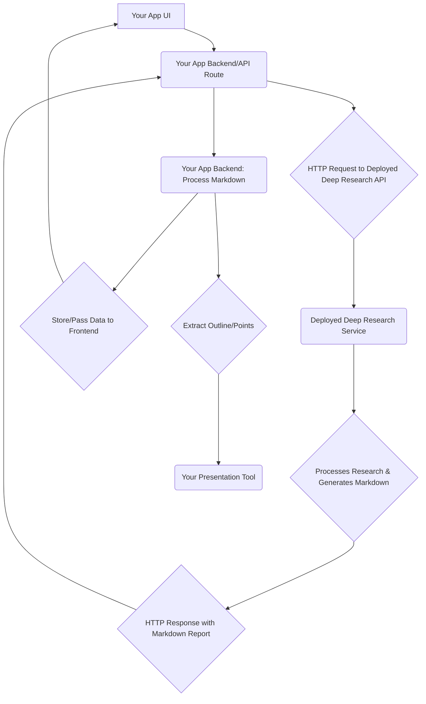

# Deep Research Integration Plan

This plan outlines the steps to integrate the `deep-research` project's capabilities into your application using its Server API and utilizing its full Markdown report output. This approach provides a good balance of leveraging `deep-research`'s functionality and maintaining flexibility for your custom UI.

## Phase 1: Set up `deep-research` as a Standalone Service

The first phase involves setting up and deploying the `deep-research` project as an independent service that your application can communicate with.

1.  **Clone and Prepare `deep-research`:**
    *   Open your terminal or command prompt.
    *   Clone the `deep-research` GitHub repository to your local machine:
        ```bash
        git clone https://github.com/u14app/deep-research.git
        ```
    *   Navigate into the cloned project directory:
        ```bash
        cd deep-research
        ```
    *   Install the project's dependencies using pnpm (recommended by the `deep-research` README, but npm or yarn can also be used):
        ```bash
        pnpm install
        # or npm install
        # or yarn install
        ```
2.  **Configure `deep-research`:**
    *   Copy the example environment variables file:
        ```bash
        cp env.tpl .env
        ```
    *   Open the newly created `.env` file in a text editor.
    *   Add the necessary API keys for the Language Models (LLMs) and search engines that `deep-research` will use. Refer to the `deep-research` README's "Configuration" section for the specific environment variables required (e.g., `GOOGLE_GENERATIVE_AI_API_KEY`). You will need to obtain these API keys from the respective AI model and search engine providers.
3.  **Build `deep-research`:**
    *   Build the `deep-research` project for production deployment:
        ```bash
        pnpm build
        # or npm run build
        # or yarn build
        ```
    *   This command prepares the project for deployment by optimizing and compiling the code.
4.  **Deploy `deep-research`:**
    *   Deploy the built `deep-research` project to a hosting service. The `deep-research` README suggests easy deployment options like **Vercel** or **Cloudflare Pages**.
    *   Follow the deployment instructions provided by your chosen hosting service. This will typically involve connecting the service to your `deep-research` GitHub repository (or the built output).
    *   Once deployed, you will get a live URL for your `deep-research` service (e.g., `https://your-deep-research-app.vercel.app`). Keep this URL handy, as you will need it in the next phase.

## Phase 2: Integrate with Your Application

The second phase focuses on making your application communicate with the deployed `deep-research` service and utilizing the research results.

5.  **Identify `deep-research` API Endpoint:**
    *   You need to find the specific URL endpoint within your deployed `deep-research` service that accepts a research topic and initiates the research process, returning the results.
    *   Examine the `deep-research` project's source code, particularly files within the `src/app/api/` directory (if it's a Next.js app) or equivalent API route definitions. Look for an endpoint designed to handle research requests, likely accepting a `POST` request with the topic in the body. A common pattern might be `/api/research` or `/api/generate-report`.
    *   *Note:* If the API endpoints are not explicitly documented in the `deep-research` README, exploring the `src/app/api` files in the repository will be necessary to find the correct endpoint and expected request/response format.
6.  **Implement API Call in Your App:**
    *   In your application's backend code (e.g., a server-side route, API handler, or a dedicated backend service) or within a serverless function/route if your frontend framework supports it (like Next.js API routes), write code to make an HTTP POST request to the `deep-research` API endpoint you identified in Step 5.
    *   Use a library like `node-fetch` (for Node.js) or the built-in `fetch` API (in modern JavaScript environments) to make the request.
    *   Include the user's research topic in the body of the POST request, typically as a JSON object (e.g., `{ "topic": "Your Research Topic" }`).
    *   Handle the response from the `deep-research` service. The response should contain the research report, which, based on our plan, you anticipate receiving as a Markdown string.
7.  **Process and Use the Markdown Report:**
    *   Once your application receives the Markdown string from `deep-research`, you have the full research content.
    *   **Displaying the Report:** To display the Markdown report beautifully in your application's user interface, use a Markdown rendering library appropriate for your frontend framework. For React/Next.js applications, popular choices include `react-markdown` or `marked`. These libraries take a Markdown string and convert it into HTML that your browser can render.
    *   **Generating Presentations:** To integrate with your presentation tool, you'll need to parse the Markdown string to extract the structure (titles, headings, bullet points, paragraphs). You can either implement a simple parser yourself (looking for Markdown syntax like `#` for headings, `-` or `*` for list items) or use a dedicated Markdown parsing library (like `remark` or `markdown-it`). The extracted structure can then be transformed into the data format required by your presentation generation logic.
8.  **Build Your Custom UI:**
    *   Design and implement the user interface for the research feature in your application using your preferred frontend framework and styling libraries (like Shadcn UI).
    *   Include input fields for the user to enter the research topic.
    *   Add a button or mechanism to trigger the research process, which will call the backend/API route you implemented in Step 6.
    *   Create a section in your UI to display the rendered Markdown research report (using the method from Step 7).
    *   Add controls or functionality to initiate the presentation generation process, using the parsed research data (from Step 7).

## Data Flow Summary (Server API)



This plan allows you to integrate the powerful research capabilities of `deep-research` while maintaining complete control over the user experience through your own modern UI.